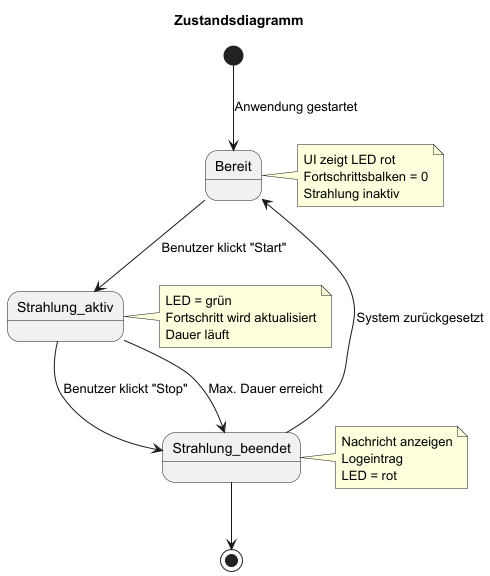
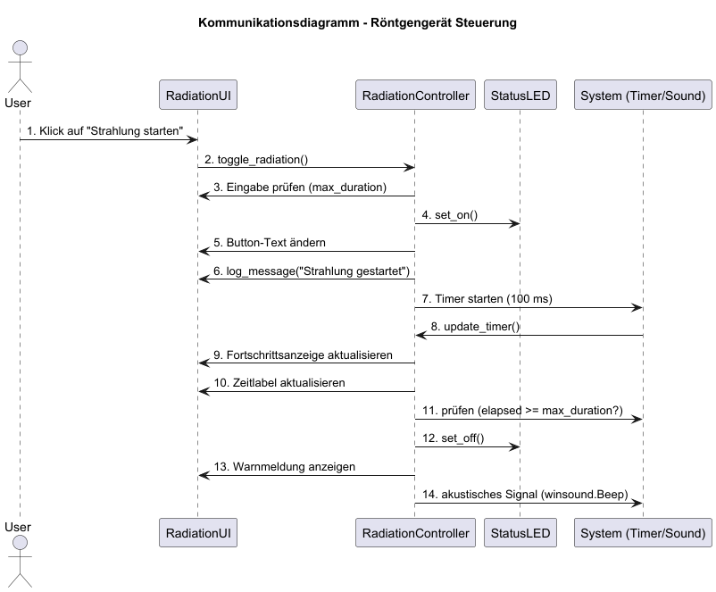

# Design
Im Folgenden sind erste, exemplarische Entwürfe eines Klassendiagramms, Sequenzdiagramms, Zustanddiagramms und eines überarbeiteten Komponentendiagramms dargestellt. Verwendet für die Erstellung wurde der Online UML-Editor [PlantUML](https://editor.plantuml.com/).
## Klassendiagramm


## Sequenzdiagramm


## Zustandsdiagramm


## Kommunikationsdiagramm


## Designpatterns

| Pattern                     | Wo im Projekt                                                                     | Grund                                                                        |
|-----------------------------|-----------------------------------------------------------------------------------|------------------------------------------------------------------------------|
| MVC (Model-View-Controller) | GUI (View), Controller, System (Model)                                            | Trennung von Darstellung, Logik und Daten                                    |
| Proxy                       | Systemschicht                                                                     | Systemschicht kapselt Zugriff auf OS-/Hardwarefunktionen (z.B. Sound, Timer) |
| Observer                    | ```update_timer()```                                                              | GUI beobachtet Änderungen vom Controller                                     |
| Facade                      | GUI spricht nur über ```RadiationController```, nicht direkt mit Systemfunktionen | Vereinfacht Schnittstellen                                                   |


