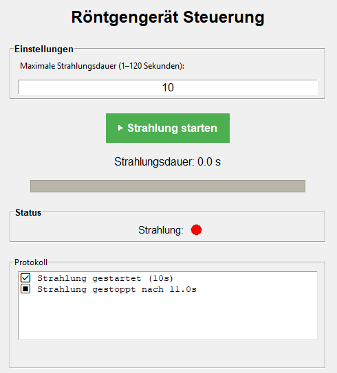

# Implementierung
## Traceability-Matrix
[Traceability-Matrix](./Traceability-Matrix1.md)
## Allgemeine Projektmetriken
| **Metrik**               | **Wert**                                        | **Beschreibung**                                |
|--------------------------|-------------------------------------------------|-------------------------------------------------|
| Programmiersprache       | Python 3.11                                     | Dynamisch typisiert, objektorientiert, modern   |
| IDE                      | PyCharm                                         | Standard Python-IDE, kompatibel für Doku in .md |
| Dateien (Module)         | 3 (GUI, Steuerung, System)                      | Nach Schichten getrennt                         |
| Klassen                  | 3 (StatusLED, RadiationController, RadiationUI) | Gute Modularität                                |
| Testabdeckung (Ziel)     | ≥ 80 %                                          | Empfehlung für Unit Tests                       |  
| Abhängigkeiten (Imports) | tkinter, time, platform, winsound               | Nur Standardbibliothek → portabel               |  
| Architekturprinzip       | MVC-ähnlich (GUI - Controller - System)         | Gute Trennung der Verantwortlichkeiten          |

## Erste Skizzen/Entwürfe der UI

```
+--------------------------------------------------+
|    RÖNTGENGERÄT STRAHLUNGSDAUER SIMULATION       |
+--------------------------------------------------+
| Einstellung Strahlungsdauer: [  45  ] Sekunden   |
| (Wertebereich: 1 - 120 sec)                     |
|                                                  |
| [ Start Strahlung ]   [ NOT-AUS (STOP) ]         |
|                                                  |
| Fortschritt: [##########--------] 45 / 120 Sek.  |
|                                                  |
| Status: [ Aktiv/Inaktiv ]                        |
|                                                  |
|                                                  |
|                                                  |
|--------------------------------------------------|
| Verlauf vergangener Strahlungsvorgänge:          |
|  1) Start: 10:30, Stop: 10:31, Dauer: 60 Sek.    |
|  2) Start: 11:00, Stop: 11:02, Dauer: 120 Sek.   |
+--------------------------------------------------+
```



